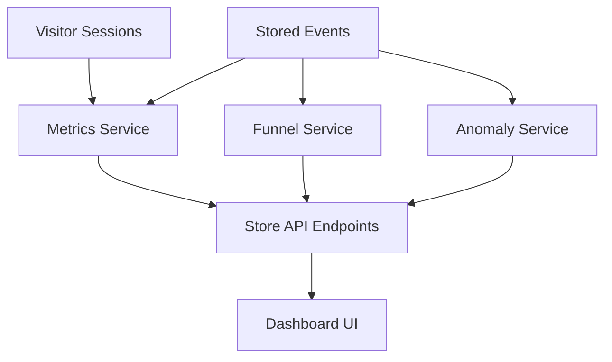
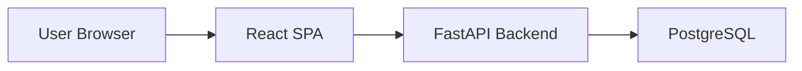
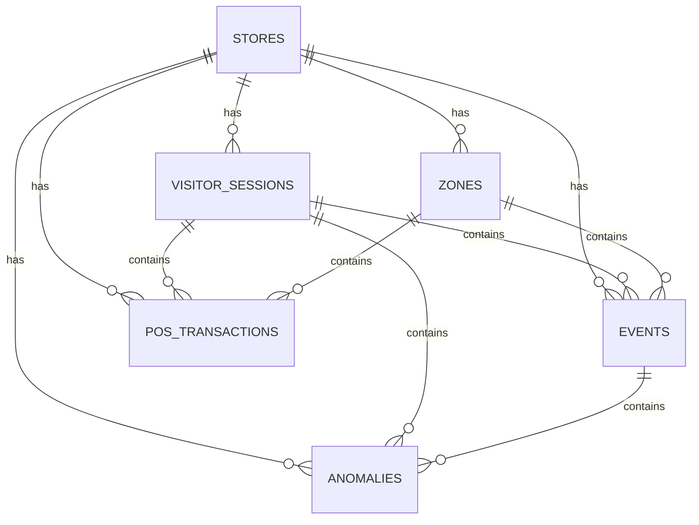

# Architecture Overview

This document describes the architecture of the Purplle Store Intelligence repository, including the CCTV processing pipeline, event schema, ingestion API, analytics layer, dashboard, and database.

## 1. System Overview

The solution is composed of three main domains:

- `CCTV Processing Pipeline` — consumes raw camera feeds and emits structured store events.
- `API / Analytics` — receives event data, stores it, and exposes aggregated analytics.
- `Dashboard` — presents store KPIs, funnel insights, heatmap approximations, and anomalies.

Mermaid system diagram:

```mermaid
flowchart LR
    A[CCTV Cameras / Video Files] -->|Frames| B[Pipeline Runner (`pipeline/run.py`)]
    B --> C[Detection Layer (`pipeline/detect.py`)]
    C --> D[Tracking Layer (`pipeline/tracker.py`)]
    D --> E[Session Manager (`pipeline/sessions.py`)]
    E --> F[Event Writer (`pipeline/events.py`)]
    F --> G[Event JSONL / Payload]
    G -->|POST /events/ingest| H[Ingestion API (`app/api/routers/events.py`)]
    H --> I[PostgreSQL Database]
    I --> J[Analytics API (`app/api/routers/stores.py`, `app/api/routers/anomalies.py`)]
    J --> K[Dashboard (`dashboard/frontend`)]
```

## 2. CCTV Processing Pipeline

The CCTV pipeline is orchestrated by `pipeline/run.py`.

Key responsibilities:

- open a video source with OpenCV
- convert each frame into detections
- update active tracks
- emit occupancy and transition events via the session manager
- write structured events to a JSONL file

Primary components:

- `pipeline/detect.py` — object detection
- `pipeline/tracker.py` — multi-object tracking
- `pipeline/zones.py` — camera zone definitions and point-in-polygon checks
- `pipeline/sessions.py` — session lifecycle and event emission
- `pipeline/events.py` — event DTO and JSONL writer

The pipeline is designed to support both live camera feeds and recorded video files.

## 3. YOLO Detection Layer

The detection layer is implemented in `pipeline/detect.py`.

- Uses `ultralytics.YOLO` if available.
- Defaults to the `yolov8n.pt` model.
- Converts each frame into a list of detections with:
  - `bbox`: bounding box coordinates
  - `confidence`: detection score
  - `class_id`, `class_name`

If YOLO is not available, the detector currently returns an empty list, which disables tracking and event generation.

## 4. Tracking Layer

Tracking is handled by `pipeline/tracker.py`.

- The `Tracker` wrapper chooses `ByteTracker` if installed; otherwise it falls back to `SimpleTracker`.
- `SimpleTracker` maintains tracks by matching detection centers across frames.
- Each active object receives a stable `track_id`.

Tracker behavior:

- match detections to existing tracks using nearest center distance
- update track position and confidence
- create a new track for unmatched detections
- drop stale tracks after `max_missing` frames

This stable `track_id` is the basis for session lifecycle logic and event emission.

## 5. Session Management

The session manager is implemented in `pipeline/sessions.py`.

Responsibilities:

- convert tracks into store visit sessions
- detect:
  - `ENTRY`
  - `EXIT`
  - `REENTRY`
  - `ZONE_ENTER`
  - `ZONE_EXIT`
  - `BILLING_QUEUE_JOIN`
  - `BILLING_QUEUE_ABANDON`
- track zone dwell times and queue behavior
- handle reentry heuristics for entrance camera `CAM3`

Important behaviors:

- A new track may receive a persisted `visitor_id` if it matches a recently departed visitor within a reentry window.
- `CAM3` is treated as an entrance camera; on first appearance it emits `ENTRY` or `REENTRY` immediately when no entry line is configured.
- Zone transitions are detected by comparing the current track center against zone polygons from `config/store_zones.yaml`.
- If a track enters a checkout zone, the session emits `BILLING_QUEUE_JOIN`.
- Leaving a checkout zone while still in-queue emits `BILLING_QUEUE_ABANDON`.

## 6. Event Schema

Pipeline events are defined in `pipeline/events.py` as an `Event` dataclass and emitted as JSON lines.

Event fields:

- `event_id`: UUID
- `store_id`: int
- `camera_id`: str
- `visitor_id`: str
- `event_type`: str
- `timestamp`: ISO 8601 timestamp
- `zone_id`: optional int
- `dwell_ms`: optional int
- `is_staff`: bool
- `confidence`: float
- `metadata`: optional JSON object

The API-level validation model is `app/schemas/event.py`, which defines `ChallengeEvent` with stricter rules:

- `event_type` must be one of:
  - `ENTRY`, `EXIT`, `ZONE_ENTER`, `ZONE_EXIT`, `ZONE_DWELL`, `BILLING_QUEUE_JOIN`, `BILLING_QUEUE_ABANDON`, `PURCHASE`, `REENTRY`
- `timestamp` must include timezone information
- `confidence` is a float between `0.0` and `1.0`
- `metadata` must be a JSON object

Sample generated events from `output/events_cam3.jsonl` include:

- `ENTRY`
- `EXIT`
- `REENTRY`
- `ZONE_ENTER`
- `ZONE_EXIT`

Event counts in the sample file show a mix of entry/exit and zone transition events, demonstrating the pipeline’s session and zone detection behavior.

## 7. Event Ingestion API

The ingestion API is implemented in `app/api/routers/events.py`.

Endpoint:

- `POST /events/ingest`

Behavior:

- accepts a list of event payloads
- rejects requests larger than 500 events
- validates each payload against `ChallengeEvent`
- stores valid events via the ingestion service
- returns counts for accepted events, duplicates, rejected events, and validation errors

The router uses FastAPI dependency injection with `app.database.connection.get_db`.

## 8. Analytics Engine

The analytics layer is exposed by service endpoints, although the central `app/services/analytics_service.py` file is currently a placeholder.

Relevant API endpoints:

- `GET /stores/{store_id}/metrics` — returns store metrics
- `GET /stores/{store_id}/funnel` — returns funnel stage data
- `GET /stores/{store_id}/anomalies` — returns detected anomalies

Current analytics models include:

- `app/schemas/metrics.py` — `StoreMetrics`
- `app/schemas/funnel.py` — `StoreFunnel`
- `app/schemas/anomaly.py` — `StoreAnomaly`

These are used by `app/services/metrics_service.py`, `app/services/funnel_service.py`, and `app/services/anomaly_service.py` to transform DB records into API responses.

Mermaid analytics flow:



## 9. Dashboard Architecture

The dashboard is a React single-page application located in `dashboard/frontend`.

Key features:

- uses Vite and React
- routes defined in `dashboard/frontend/src/App.jsx`
- pages:
  - `Overview`
  - `Metrics`
  - `Funnel`
  - `Heatmap`
  - `Anomalies`
- API integration through `dashboard/frontend/src/services/api.js`
- environment-driven backend base URL via `VITE_API_BASE`
- build output served by Nginx in `docker/Dockerfile.dashboard`

Dashboard data flow:

- frontend page requests store metrics and funnel data
- API calls are made to the FastAPI backend
- charts and KPI cards render aggregated results

Mermaid dashboard flow:



## 10. Database Schema

The database schema is defined in `app/database/models/models.py`.

Core tables:

- `stores`
  - store metadata and location data
  - relationships to sessions, zones, events, anomalies, and transactions

- `zones`
  - store-specific camera zones
  - zone name, type, polygon layout, and metadata

- `visitor_sessions`
  - session lifecycle records with entry/exit timestamps
  - repeat visitor and staff flags

- `events`
  - event-level records with `event_type`, `camera_id`, `visitor_id`, dwell time, confidence, and metadata
  - links to `stores`, `visitor_sessions`, and `zones`

- `anomalies`
  - anomaly records linked to stores, sessions, and events
  - severity, status, and description

- `pos_transactions`
  - optional POS transaction data linked to sessions and zones

Mermaid ER diagram:



### Event table notes

- `events.event_id` is enforced as unique.
- `events.event_time` is stored with timezone-aware timestamps.
- `events.dwell_ms` captures the duration of zone or visit events.
- `events.confidence` stores detection confidence.
- `events.metadata` is a JSONB payload for extensibility.

### Other schema notes

- `visitor_sessions` supports repeat visitor tracking and staff flagging.
- `zones` support named zones and zone types, which drive queue and shelf event logic.

## Observations

- The repository has a clean separation between video processing and API/dashboard layers.
- The event schema is central to both pipeline generation and API ingestion.
- The analytics engine is partially implemented through endpoint scaffolding and schema definitions.
- The dashboard is structured to consume metrics, funnel, and anomaly APIs.

This architecture provides a strong foundation for end-to-end CCTV event ingestion, store analytics, and visualization.
